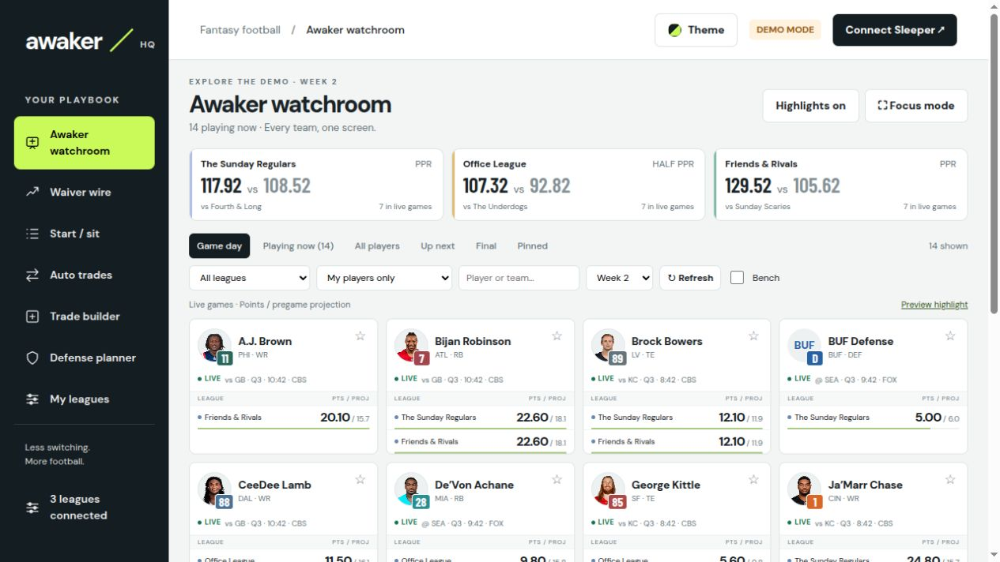
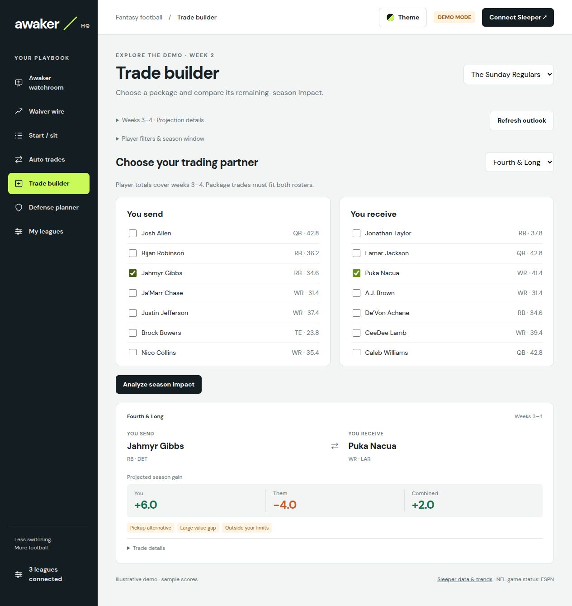

# Awaker

**Your Sleeper leagues, wide awake.**

If you're in more than one fantasy league, Sunday means flipping between tabs and losing track of who's playing who. Awaker puts every league on one screen: your players, your opponents' players, and what the scoreboard is doing to all of your teams at once.

It also answers the questions you actually ask on a Sunday morning. Who should I start? Is anyone worth grabbing off waivers? Would this trade help me or help them more? You run it yourself, on your computer or your own server.

[](https://github.com/afk-sapien/awaker/actions/workflows/ci.yml)
[](https://github.com/afk-sapien/awaker/actions/workflows/release-containers.yml)
[](LICENSE)



*The real app with demo leagues. No Sleeper password, no subscription, no transactions.*

## What it does

Every league lands in one watchroom, with your players and your opponents' side by side, favorites pinned, and a focus mode for game day. Start/sit comparisons use your league's actual scoring, flex rules and started-game locks, so the advice matches the league you're in and not a generic average.

Beyond that there's the waiver wire, trade ideas and defense streaming. The trade builder is the one people seem to like most: a trade can help you and help the other manager more, so it shows both sides and compares what you could have picked up instead.

<details>
<summary>See the trade builder</summary>



Projections are estimates, and it says so when it isn't sure.

</details>

There's an optional background service for scheduled reports, phone notifications and agent access. You can also recolor all 32 teams, if that's your thing.

## Getting started

The dashboard opens with sample leagues, so you can poke around before connecting anything.

**With [pipx](https://pipx.pypa.io/stable/installation/)** (needs Python 3.11+ and Git):

```sh
pipx install "git+https://github.com/afk-sapien/awaker.git"
awaker
```

Then open **[http://127.0.0.1:4173](http://127.0.0.1:4173)**, and leave the terminal open while you use it. Ctrl+C stops it. Node comes bundled, so you don't need to install it. `awaker --port 8080` moves it elsewhere.

<details>
<summary>Prefer pip and a virtual environment?</summary>

```sh
python -m venv .venv
```

Activate it (`source .venv/bin/activate`, or `.venv\Scripts\Activate.ps1` on Windows), then:

```sh
python -m pip install "git+https://github.com/afk-sapien/awaker.git"
awaker
```

`python -m pip install .` works from a checkout. Awaker isn't on PyPI yet, so plain `pip install awaker` gets someone else's package. The bundled Node comes from [nodejs-wheel-binaries](https://pypi.org/project/nodejs-wheel-binaries/); see [supported platforms](docs/self-hosting.md#python-installation).

</details>

**With Docker:**

```sh
docker run -d --name awaker --restart unless-stopped --init \
  --read-only --cap-drop=ALL --security-opt=no-new-privileges \
  -p 127.0.0.1:4173:4173 -v awaker-data:/app/data \
  -e SLEEPER_USERNAME=your-sleeper-name \
  ghcr.io/afk-sapien/awaker:latest
```

Same address. That is the whole install: one container, no accounts, and schedules, alerts and phone notifications are set up in the browser. Leave out `SLEEPER_USERNAME` to get the dashboard alone. To reach it from another machine, publish `-p 4173:4173` and add `-e AWAKER_PUBLIC_URL=http://your-server:4173`, because Awaker only answers on the address it was told to expect. `docker stop awaker` and `docker start awaker` do what you'd expect. Images are public and cover Linux AMD64 and ARM64. `latest` follows stable releases, version tags like `0.2.0` pin one, and `edge` is the preview channel.

<details>
<summary>Prefer Docker Compose?</summary>

Save this as `compose.yaml` and run `docker compose up -d`:

```yaml
services:
  awaker:
    image: ghcr.io/afk-sapien/awaker:latest
    container_name: awaker
    environment:
      SLEEPER_USERNAME: your-sleeper-name
    ports:
      - "127.0.0.1:4173:4173"
    volumes:
      - awaker-data:/app/data
    restart: unless-stopped
    init: true
    read_only: true
    cap_drop: [ALL]
    security_opt: [no-new-privileges:true]
volumes:
  awaker-data:
```

[compose.yaml](compose.yaml) in the repository is the same thing with an optional `.env` and a
pinnable image. [Registry access, Compose and upgrades](docs/self-hosting.md#prebuilt-containers)
has the details, including [moving from the two 0.2.0 containers](docs/self-hosting.md#upgrading-from-020-two-containers-to-one).

</details>

**Then connect your leagues:** click **Connect Sleeper**, enter your public Sleeper username, and pick which leagues show up in **My leagues**. Roster moves still happen in Sleeper; Awaker only reads. Your preferences live in that browser, so come back to the same address each time (`localhost` and `127.0.0.1` count as different addresses).

## Reports while you're away

Everything above runs in your browser. Name the Sleeper account you want followed and the same app also runs in the background: scheduled reports, trade and waiver alerts, optional phone notifications, and read-only tools for an AI assistant.

```sh
awaker service --username YOUR_SLEEPER_NAME
```

With Docker, that is the `SLEEPER_USERNAME` in the command above. Same image, same address. Open [Agents & updates](http://127.0.0.1:4173/integrations.html) to pick schedules and alert thresholds, which start switched off. Every few hours (six by default) it compares trades and the waiver wire, and sends one notification when something new clears the projected gain you chose.

Phone pushes go through [ntfy](https://ntfy.sh) and need no account: on the same page, generate a random topic, save it, subscribe to that topic in the ntfy app, and send a test. A self-hosted ntfy server and an access token are optional.

There's no login. The account it reports on is read from the environment and can't be changed from the browser, so it can only ever report on your leagues. Schedules, thresholds and where notifications go are editable by anyone who can reach it, the same as any small self-hosted tool. Run `awaker setup` to generate an owner token and a read-only agent token if you want a sign-in, and set up HTTPS before exposing it anywhere.

[Self-hosting](docs/self-hosting.md) covers configuration and backups; [integrations](docs/integrations.md) covers agents, schedules and ntfy.

## Honest limits

Worth knowing before you trust it with a lineup decision:

- **Projections are projections.** Advice ranks projected points. It doesn't model whether someone would accept a trade, dynasty picks, FAAB, deadlines, or every exotic scoring bonus. Missing estimates show up as unavailable rather than as a guess.
- **Scores lag the broadcast.** Open tabs refresh every 45 seconds, and cached player details can be a day old, so this is not an injury alert system. Trade and waiver scans run every six hours by default, or as often as hourly.
- **It leans on unofficial endpoints.** League data comes from the [documented Sleeper API](https://docs.sleeper.com/), but projections and ESPN game status use undocumented endpoints that can change or break.
- **Your data stays with you.** Browser preferences stay in your browser. Service settings, caches and reports live in a local SQLite file that can contain private league strategy, so protect `.env`, the data volume and your backups. No analytics, no telemetry.

The browser talks to `api.sleeper.app`, `site.api.espn.com` and `sleepercdn.com`. Sleeper's terms allow noncommercial use; talk to them about anything commercial. Awaker is an independent project, unaffiliated with Sleeper, ESPN or the NFL.

## Development

Clone it, install Node 24, run `npm start`. Source lives in `dist/` despite the name, there's no build step, and there are no third-party JavaScript runtime dependencies.

```sh
npm run verify
node scripts/container-smoke.js
node scripts/scan-images.js
```

The last two need Docker. CI covers Node 22 and 24, installed Python packages on Linux, macOS and Windows, and the container on AMD64 and ARM64. It also scans history for secrets and images for known vulnerabilities, and blocks publishing on HIGH or CRITICAL findings. See [release instructions](docs/releasing.md).

[Contributing](CONTRIBUTING.md) · [Code of conduct](CODE_OF_CONDUCT.md) · [Getting help](SUPPORT.md) · [Security reporting](SECURITY.md) · [Changelog](CHANGELOG.md)

Awaker is [MIT licensed](LICENSE). External data, player photos and third-party names and trademarks belong to their owners.
